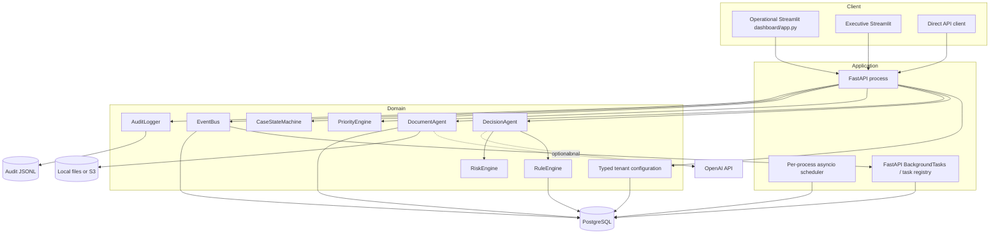
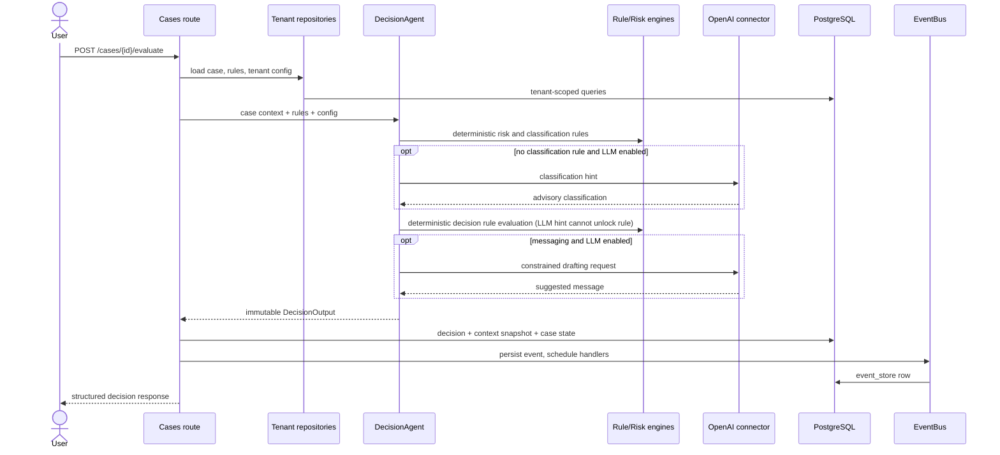
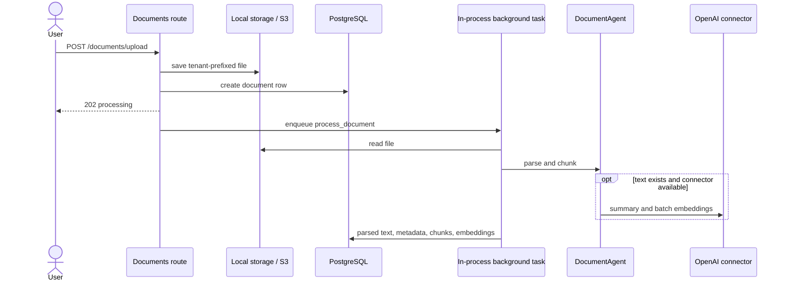

# URAKI AI Platform Architecture

**Status: FUNCTIONAL PROTOTYPE.**

## Scope

This document describes only the architecture visible in the repository. It does not assert a deployed environment, production traffic, external users, measured performance, or operational security guarantees.

## Verified implemented capabilities

- FastAPI routes for authentication, cases, decisions, documents, tenant configuration, and dashboard data.
- Tenant-scoped SQLAlchemy repositories and PostgreSQL models with Alembic revisions 0001-0003. Revision 0003 enforces parent-child tenant ownership with composite foreign keys.
- Deterministic rule, risk, priority, and state engines with optional LLM-assisted classification, drafting, summaries, and embeddings.
- Local or S3 document storage, PDF/DOCX/text extraction, chunking, and Python cosine ranking over JSONB embeddings.
- Persisted decisions, context snapshots, overrides, events, and JSONL audit records.
- Streamlit interfaces plus Docker definitions for PostgreSQL, the API, and two dashboards.

## System context

URAKI is a decision-support application for real-estate operations. Its represented actors are:

- **operator:** creates, reviews, evaluates, and transitions cases;
- **legal:** reads, writes, and escalates cases;
- **executive:** reads executive views;
- **administrator:** manages tenant configuration, rules, API keys, and broader operations;
- **external AI service:** provides optional OpenAI chat and embedding responses;
- **object storage:** local filesystem or S3 for uploaded documents.

## Runtime containers represented by code

The scheduler and background tasks are not separate deployed workers in the code. They execute inside API processes.

## Backend layering

### HTTP and identity layer

`main.py` creates the FastAPI application, installs CORS, request logging, tenant-hint and rate-limit middleware, mounts routes, and optionally starts the scheduler during lifespan. Shutdown cancels tasks even on an exceptional exit.

Authentication supports:

- password login backed by `User` rows and bcrypt password hashes;
- HS256 bearer JWTs containing user, tenant, role, and email claims;
- API keys stored as SHA-256 digests and resolved to their owning active user in an active tenant; unowned legacy keys are rejected.

The authenticated database user is authoritative for tenant context. `TenantMiddleware` decodes the JWT only to add a logging hint; it does not authorize the request and ignores client `X-Tenant-ID` for that purpose.

### Application orchestration layer

Routes coordinate repositories and domain services. `DecisionAgent` is the central decision pipeline; `DocumentAgent` owns parsing and chunking; `MessageAgent` builds constrained communications; `ClassifierAgent` applies rule-first classification.

### Domain layer

- `RuleEngine` evaluates versioned condition/action records and resolves matches by priority.
- `RiskEngine` calculates a weighted score from overdue duration, economic impact, legal action, and recurrence.
- `PriorityEngine` calculates an operational priority from risk, overdue days, and flags.
- `CaseStateMachine` restricts allowed status transitions.
- `DecisionOutput` is a frozen Pydantic contract with validation and audit serialization.
- `ConfigEngine` converts tenant JSONB settings into frozen typed models.
- `CommunicationEngine` provides structured templates and output validation for optional LLM drafting.

### Data-access layer

`BaseRepository` requires `tenant_id` and exposes scoped query builders. Tenant-aware repositories inherit from it. `TenantRepository` is a documented platform-scope exception.

This pattern reduces accidental cross-tenant reads but cannot prevent a developer from issuing an unscoped raw query. PostgreSQL row-level security is not configured.

## Case decision sequence

### Decision authority

The LLM can influence the displayed fallback classification and suggested wording. Only rule-derived classification enters decision-rule matching. Invalid factual drafts are suppressed; the LLM does not assign risk, priority, state, or action. When no decision rule matches, the action defaults to `REVISAR_MANUALMENTE`.

An LLM prompt constraint is not a runtime proof of factual correctness. Consumers should treat generated text as advisory.

## Document sequence

PDF and DOCX parsing are synchronous library calls inside the background task. The upload route accepts PDF, DOCX and UTF-8 text, checks extension/signature and bounds size. OCR is not implemented. Storage reads require tenant context and reject paths outside that namespace.

## Persistence model

| Aggregate | Main evidence retained |
| --- | --- |
| Tenant | Identity, plan label, active flag |
| Configuration | Per-tenant typed configuration source values |
| Rule | Conditions, actions, priority, version, effective period, parent version |
| Case | Operational and financial inputs, status, priority, raw context |
| Decision | Classification, scores, action, flags, rule trace, full output, context snapshot |
| Override | Original action, new action, reason, user, case, decision |
| Document | Storage path, parsed text, processing metadata |
| DocumentChunk | Tenant/document identifiers, text, JSONB embedding |
| EventStore | Tenant, aggregate, payload, processed/error fields |
| AuditLog | Database model exists, but the synchronous `AuditLogger` writes JSONL only |

The initial migration creates 14 tables and has a downgrade path.

## Eventing and automation

`EventBus.publish` flushes an `EventStore` row before dispatch. When called by HTTP routes, dispatch is added to FastAPI `BackgroundTasks`. Handlers log events and can invoke the task registry.

Current limitations:

- dispatch is process-local and has no durable retry worker;
- deferred dispatch claims a committed event under a row lock, preventing a second attempt for the same event ID;
- handler failures record exception type and event ID; replay exposes processing time/error;
- a crash after claim remains `dispatch_in_progress` for operator diagnosis rather than automatic retry;
- no outbox transaction or external broker is implemented.

The scheduler launches three asyncio loops when RUN_SCHEDULER=true. The container entrypoint defaults to one worker and rejects multiple workers with the scheduler enabled. This guard does not establish distributed ownership across separate replicas.

## Security & Production Readiness Gaps

### Verified controls

- startup secret-key validation;
- bcrypt password hashing;
- signed, expiring JWTs revalidated against active user rows;
- hashed and expiring API keys;
- explicit CORS allowlist;
- selected role checks;
- tenant-scoped repository helpers;
- non-root container user;
- production-disabled API documentation;
- Git/local-secret exclusion from the Docker build context.

### Known gaps

- No MFA, account lockout, PostgreSQL row-level security, malware scanning, external pentest or encryption-at-rest assurance.
- Rate limiting is DB-backed and fails open on storage errors; deployment-level abuse protection remains necessary.
- Password creation requires at least 12 characters and at most 72 UTF-8 bytes to prevent bcrypt truncation. Existing overlength-password hashes require an authorized reset; no credentials were changed.
- Local storage namespace checks do not protect against a hostile OS actor racing filesystem changes.
- PostgreSQL is host-published by Compose; settings still contain an explicit local-development database fallback.
- The clean public release's hosted CI validates migrations and selected ownership constraints against ephemeral PostgreSQL 16. Local database restart, Docker image execution and browser end-to-end integration remain unverified.

`.dockerignore` mitigates Docker build-context exposure by excluding local secrets, Git history, runtime data, caches, and archives. Image contents and container behavior remain unverified because only static container-contract checks are recorded locally.

## Failure semantics

| Failure | Current behavior |
| --- | --- |
| Invalid/missing startup secret | Application lifespan raises and refuses to serve |
| Database request error | Session dependency rolls back and re-raises |
| No matching decision rule | Returns manual-review action |
| Case evaluation state update | Rejects evaluation from disallowed states before changing status |
| LLM classification error | Logged; classifier falls back to `OTRO` |
| LLM message error | Logged; decision persists without a message |
| Document parse/embedding error | Processing metadata distinguishes failure or processing without embeddings |
| Event handler error | Exception type recorded; no durable retry guarantee |
| Rate-limit storage error | Mounted middleware fails open; deployment-level protection remains a gap |
| Audit JSONL write error | Logged and business request continues |
| Dashboard transient HTTP status | GET/HEAD retries selected transient responses; mutations are not retried |

## Interface inventory

The repository contains two Streamlit surfaces with distinct audiences:

1. `dashboard/app.py` provides the modular operational interface;
2. `executive.py` provides the executive view used by Compose.

Canonical runtime, tests, Docker and documented commands point to packaged backend paths. Historical root-level backend copies and the legacy `operational.py` entry point are absent from the working tree and remain recoverable from Git history.

## Known limitations

- No production deployment or live-service evidence is present. Hosted CI validates a bounded migration/constraint contract against ephemeral PostgreSQL; local unit and mocked integration tests cover application behavior.
- Validation includes unittest suites and repository validators; provider calls are mocked and local PostgreSQL is not provisioned.
- Image uploads are rejected; OCR is not implemented.
- Notification delivery is explicitly unimplemented and raises rather than reporting a send.
- Embeddings are JSONB arrays ranked with Python cosine similarity, not a dedicated vector database or index.
- Dashboard memory, feedback and observability helpers are experimental: some target API endpoints that are not implemented, and same-session similarity is non-persistent.
- Events, background tasks, and scheduled jobs are process-local.
- DB-backed rate limiting is mounted; storage errors fail open.

## Engineering Decisions & Trade-offs

- **Deterministic authority, optional LLM assistance:** rules own risk, priority, state, and decision actions; the LLM can assist fallback classification, wording, summaries, and embeddings. This favors traceability but requires maintained rule sets and human review of generated content.
- **JSONB vectors and Python similarity:** this avoids an additional vector service for the prototype, but loads candidates into application memory and does not establish scalable retrieval performance.
- **Human override and audit context:** overrides preserve original and replacement actions, actor, and reason instead of silently replacing the decision. This supports reviewability but still depends on the current role checks and governance process.
- **Prototype-local infrastructure:** in-process scheduling, background tasks, JSONL auditing, and script validations reduce setup complexity while limiting durability, multi-worker safety, and production-readiness evidence.

## Architecture decisions that remain open

1. Validate controlled CLI bootstrap, administrator-only registration and tenant-slug login against real PostgreSQL.
2. Decide whether rate limiting belongs in PostgreSQL or a shared Redis service.
3. Select a durable task/event delivery model and scheduler ownership strategy.
4. Define evidence-based thresholds for adopting a dedicated vector index or service.
5. Define audit retention, redaction, and destination requirements.
6. Extend database evidence beyond the bounded hosted migration/constraint contract before making production-readiness claims.
