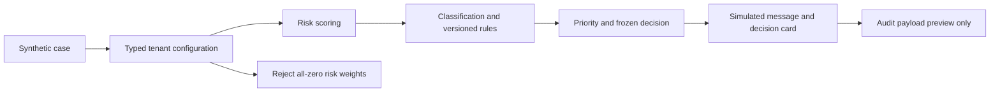

# Synthetic offline walkthrough

Run `python -B demo.py`. The walkthrough uses explicit synthetic resident and
property identifiers, simulated communication output, no database connection
and no provider invocation. Runtime labels expose `external_writes=false` and
`database_writes=false`.



This script is engine-level evidence. The integrated, dependency-free
walkthrough is executable with:

```sh
python -B -m unittest tests.integration.test_synthetic_golden_path -v
```

The integration test uses the real dashboard HTTP client, FastAPI routing, JWT
login, decision/risk/priority engines, response validation and state machine.
It runs login -> case -> document -> evaluation -> human override ->
audit/events -> operational/executive dashboards. Persistence and storage are
explicit in-memory fakes and network calls are intercepted in-process. This is
safe integration evidence; it is not PostgreSQL, provider, or browser E2E
evidence.

`tests.smoke.test_dashboard_app` renders the Streamlit entrypoint with its
official `AppTest` harness and verifies the login inputs and submit control
without exceptions. A 1440x900 dashboard capture produced from the in-memory
synthetic backend is included at `docs/assets/uraki-dashboard-overview.png`;
its provenance is recorded in `docs/portfolio/VISUAL_ASSETS.md`. This is visual
evidence, not a browser end-to-end test against PostgreSQL or external providers.
