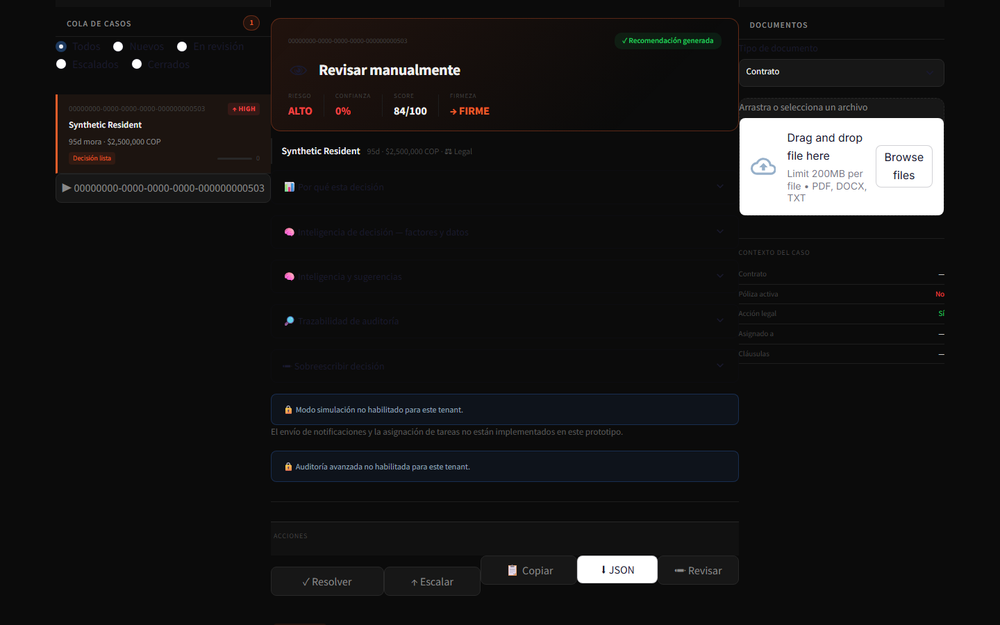

# Visual evidence

## Primary product screenshot

`docs/assets/uraki-dashboard-overview.png` is a 1440x900 capture of the actual
Streamlit operational interface. The UI authenticated against the FastAPI app
and loaded the deterministic golden-path scenario through its normal HTTP
client. The backing database, storage, queue and event dependencies were the
explicit in-memory fakes from `tests/integration/test_synthetic_golden_path.py`.

All visible identities, UUIDs, amounts and case details are synthetic. The
capture used no live database, external provider, customer data or production
credential. The local endpoint and login credential are not visible. The image
contains no embedded text metadata.

The selected case demonstrates an explicit low-confidence boundary: the engine
assigns a high deterministic risk score, finds no configured tenant rule, and
returns `Revisar manualmente` instead of presenting an unsupported automated
action. Disabled simulation and advanced-audit surfaces remain labeled in the
UI, and the notification/task limitation is visible.

## Architecture diagrams

- [System context, request security and document ingestion](../ARCHITECTURE.md)
- [Synthetic golden path](../GOLDEN_PATH.md)

These four Mermaid diagrams remain source-controlled text so Git hosting can
render them directly and reviewers can inspect the underlying flow.

## Capture record

- Captured locally on 2026-09-10 with headless Chromium through Playwright.
- Viewport: 1440x900 at device scale factor 1.
- Runtime profile: `staging`; its non-production data banner rendered above the captured viewport.
- Capture helpers and runtime audit logs were removed after verification.
